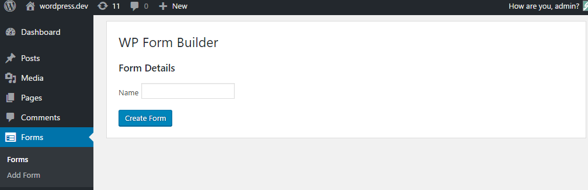

# WP Form Builder
Author: James Collings  
Version: 0.3.1  
Homepage: https://www.wpformbuilder.com/  
Documentation: https://www.wpformbuilder.com/documentation/  
Demo: https://www.wpformbuilder.com/demo/  
Created: 05/08/2016  
Updated: 01/12/2016

## About

WP Form Builder plugin make it easy to create and display forms within your WordPress theme, With a WordPress admin section where you can easily view past form submissions. 

## Features

* __Saved Submissions__ - Form submissions are automatically stored and can be viewed from within the WordPress admin area.
* __Email Notifications__ - Easily setup email notifications when forms are submitted, and customise it with template tags to display for entry data.
* __Form Validation__ - Fields can make use of multiple validation functions, each allowing for custom validation messages.
* __Field Types__ - Currently supports (text, text area, file, select, checkbox, radio)
* __Spam Protection__ - reCAPTCHA integration to help stop unwanted spam

## Documentation

* [Managing forms](#managing-forms)
* [Creating a form](#creating-a-form)
* [Managing fields](#managing-fields)
    * [Add a field](#add-a-field)
    * [Field validation](#field-validation)
    * [Remove a field](#remove-a-field)
* [Form settings](#form-settings)
    * [General settings](#general-settings)
    * [Form confirmations](#form-confirmation)
    * [Display settings](#display-settings)
    * [ReCAPTCHA settings](#recaptcha-settings)
    * [Form styles](#form-styles)
* [Form notifications](#form-notifications)
* [Form submissions](#form-submissions)
* [Adding form to page](#adding-form-to-page)
    
    

### Managing Forms

All features of the plugin can be found under the left hand menu item called “Forms”, when this section loads up you will be show a list of all previously created forms.

To interact with any form hover over the form form, you should see a list of actions should appear under the form name.

> Throughout the interface if you don't know what to do, hover over the ? to show a brief message about what that feature does.

#### Creating a Form

To create a form click on the menu item “Forms > Add Form”, or when you are on the form archive a link to create a new form should be visible next to the title of the page.

When this page loads up you have to enter the name of the form, this name will be displayed at the top of the form, this can be edited at a later date under the form settings tab.

Click the “Create Form” button to create the empty form.

#### Managing Fields

On the left hand side of the screen you will see a dashed box that says “Drop field here to add to the form” , this is the field dropzone, to the right of that is a list of fields under the title “Available Fields”.

##### Add a field

Click and drag the field that you want to add to the form from the right hand column into the field dropzone on the left hand size, If there are fields already added you can hover above or below to insert the field in the correct order you require.

Once you have dropped the field in the dropzone, a field panel should appear allowing you (as shown in the next image) to set attributes such as the field label, depending on the type of dropped field different options will be available.

Once a field has been dropped, you can easily reorder the list of fields by click and dragging on the top bar of the field panel, to make this easier you can toggle the display of the field panel by clicking on the up/down arrows at the top right corner of the field (highlighted below).

###### General Field Options

All fields have the following fields:

* Label - Text displayed before the field.
* Placeholder - Text displayed on the field before any data is inserted.
* CSS Classes - Used when styling the form via CSS

###### Text Field Options

Text fields have the following fields:

* Default value - Text entered here will populate the field when the form is loaded.

###### Textarea Field Options

Textarea fields have the following fields:

* Rows - How many rows of text will be visible (alters the height of the textbox)
* Default value - Text entered here will populate the field when the form is loaded.

###### Select Field Options

select fields have the following fields:

* Empty Text - This text will appear as an empty option
* Select Type - Allow the field to accept single or multiple options.
* Values - Values can be add/removed via the plus and minus icons on the right hand side, each row makes up an choosable option. 
    * Label - Text visible to the user
    * Value - Value of option, not visible to the user
    * Default - Check this to make to make the field pre populate with this selection.

###### Checkbox Field Options

checkbox fields have the following fields:

* Values - Values can be add/removed via the plus and minus icons on the right hand side, each row makes up an choosable option. 
    * Label - Text visible to the user
    * Value - Value of option, not visible to the user
    * Default - Check this to make to make the field pre populate with this selection.

###### Radio Field Options

radio fields have the following fields:

* Values - Values can be add/removed via the plus and minus icons on the right hand side, each row makes up an choosable option. 
    * Label - Text visible to the user
    * Value - Value of option, not visible to the user
    * Default - Check this to make to make the field pre populate with this selection.

###### File Field Options

File fields have the following fields:

* Maximum files size - Set this to the size limit of files you want to allow users to upload, enter this in megabytes as an integer (check that your php server settings “post_max_size” and “upload_max_filesize” are greater than the value you enter, otherwise this can cause problems.
* Allowed Extensions - type all the file extensions you want to allow users to upload each separated by a comma “,”.

##### Field Validation

Adding field validation rules is as easy as clicking on the “Add Validation Rule” on the field panel, once clicked a dropdown will appear allowing you to choose the type of validation you want to add. Once selected extra options will appear depending on the chosen value, by default all validation rules allow you to customise the message displayed when the field is invalid, leave the message blank to use the default validation message.

##### Remove a field

Fields can be deleted by clicking on the delete text at the top right of each field.

#### Form Settings

> If you are unclear about any fields when editing the form settings page, hover over a “?” to show a brief description about that section.

##### General Settings

* Form Name - Name of the form, displayed at the top of the form when viewed
* Form Content - Text content displayed after the title on the form.
* Submit Button Text - Set the text displayed on the forms submit button

##### Form Confirmation

* Confirmation Type - What happens when the form is complete show message or Redirect to page
* Confirmation Location - Where the confirmation message appears.
* Confirmation Message - Text to display one successful submission
* Confirmation Redirect - Location to redirect too on successful submission.

##### Display Settings

* Style Editor - Enable display the user of the style editor

##### ReCAPTCHA Settings

Add a reCAPTCHA spam field to the form, you will need to generate an api key on the recaptcha website and follow there instructions on how to get a site key and public key.

##### Form Styles

If you have enabled the style editor in the display settings, on form save a style tab will appear at the top in the header, click this to view all the style choices, each field has a “?” explaining what section it styles, click on the text input box to show a colour picker, once you have the ideal colour, click anywhere on the page to hide.

You can disable each style individually by checking the checkbox labelled “Disable”.

#### Form Notifications

Notifications are triggered on a successful form submission, you can have multiple form notifications, notification messages can contain data from the submitted form.

When a form is first created you will have a default notification setup, this will send an email to the website administrator with the subject line “New Form Submission” and in the email body a list of all the fields followed by the data submitted.

To display form data in your notification there are merge tags, these are based on the fields in your form. You can display the data from any field in the form with "{{field_FIELD_NAME}}" a list of all merge tags will appear to the right hand side of the notification message box.

#### Form Submissions

By default all form submissions are stored and can be accessed from within the forms section of the website, from the list of forms hover and click on the submissions action, or when on the edit screen click on the “Submissions” menu item.

> You can manage the columns displayed in the submission table by adding a plugin filter to your themes functions file, a way to do this visually will be coming soon.

You should see a paginated list of form submissions, which is searchable via the search entries input above. 

All new entries are highlighted with an unread label next to the entry id.

To view an entry in more detail click on the entry id, or hover over it and click on the view action.

On the left hand side is a list of all the information submitted, and on the right hand side is information about the submission such as the date/time and the user account / guest who submitted it.

#### Adding form to page

We have added a button to your WYSIWYG editor to make it simple to insert a form into a page, click the form icon highlighted in the image below to start the insert process.

A modal window will open up allowing you to choose from a list of forms previously created, once chosen click on the insert button at the bottom, this will insert the form shortcode into the current page.

## Changelog

### 0.3.1
* ADD: Form Preview link
* ADD: Edit form general error, toggle display of field errors below message
* FIX: Increase security with file upload, randomly generate folder and file prefix

### 0.3
* Plugin Released